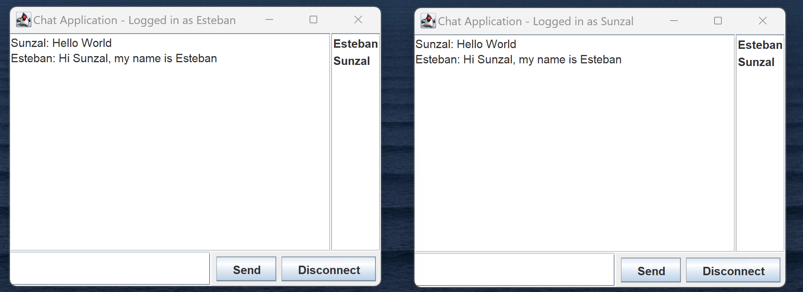

# Java Chat Server and Client

A concurrent chat application built with Java, showcasing server-client real-time communication, proper handling of multiple clients, and simple protocol design.

## Features

- **Multi-threaded Server**: Uses Java's ExecutorService to handle multiple clients simultaneously.
- **Dynamic Client List**: Broadcasts an updated list of connected clients to everyone whenever a new client joins or leaves.
- **Custom Protocol**: Uses custom-defined strings (e.g., `::clients::`, `::shutdown::`) to manage server-client communication.
- **Scalable**: Server easily handles increasing numbers of clients by utilizing a fixed thread pool.
- **Clean shutdown**: Implements a shutdown hook to ensure server resources are properly closed on exit.
- **Simple Client UI**: Easy-to-use client-side application to connect and communicate with the server.

## Technical Stack

- **Language**: Java
- **Networking**: Java Socket Programming
- **Concurrency**: ExecutorService for multi-threading on the server side.

## Getting Started

### Prerequisites

- Java JDK 11 or newer

### Running the Server

1. Clone the repository:

git clone https://github.com/your_github_username/java_chat_application.git

2. Navigate to the Server directory, compile and run:

cd java_chat_application/Server
javac *.java
java Server.ServerMain

The server will start and listen on port `12345`.

### Running the Client

1. Navigate to the Client directory, compile and run:

cd ../Client
javac *.java
java Client.ClientMain

Follow on-screen instructions to connect to the server and start chatting.

## Usage

Once the server is up, multiple clients can connect, send their username as the first message, and engage in real-time chat.

## Contributing

Pull requests are welcome! For major changes, please open an issue first to discuss what you would like to change.

## The ChatGPT Code That is Commented Out:

The plan is to create a client that calls the OpenAI API (ChatGPT), and have a friendly bot you can talk to whenever. I am still developing that aspect of the project.

## License

This project is licensed under the MIT License - see the [LICENSE.md](LICENSE.md) file for details.
